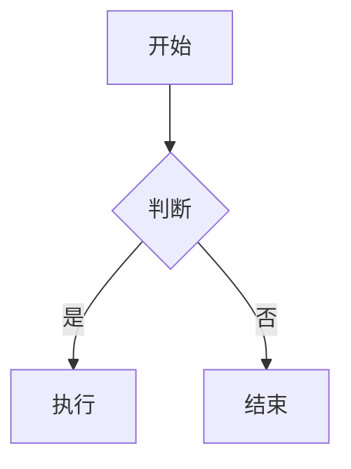

# dsh-webui — DeepSeek Harness 会话增强全家桶

一个插件融合视图切换、消息导航、技能管理、供应商管理、辅助视觉、生图/生视频、记忆、AI 浏览器、文件浏览器、Markdown 渲染与图表、工具聚合、用量统计、网页搜索、自动化、PlanWeave 计划项目、提示音、壳管理更新、网络代理、对话退回、消息截图、中文思考等能力。纯插件实现，不改动 DSH 源码。

## 一句话安装（DSH）

```bash
dsh plugin --profile web add github:statem-li/dsh-webui
```

然后在 `~/.dsh/profiles/web/cordis.patch.yml` 追加注册：

```yaml
- insert:
    - id: dsh-webui
      name: "@dsh-external/dsh-webui"
```

重启 DeepSeek Harness 即可。

> 注：webui 接管了技能 slash 源（`/` 菜单），安装后需在 `~/.dsh/profiles/web/cordis.patch.yml` 禁用内核 ui-skill 插件以避免同名源冲突：

```yaml
- id: ui-skill
  name: "@deepseek-ai/dsh-client-ui-skill"
  disabled: true
```

## 按需启停功能模块

dsh-webui 是全家桶，但每个功能模块都可以单独关闭——不需要的功能不装配（host 不注册对应工具 / provider / HTTP API，client 不注册对应 UI 槽位），界面更干净、加载更轻。

**配置方法**（二选一，改完重启 DSH 生效）：

1. 编辑 `~/.dsh/profiles/web/settings.yaml`，加 `webui-modules` 命名空间，把想关的模块显式写为 `false`（没写的模块全部保持启用，升级新增模块时老配置自动兼容）：

```yaml
webui-modules:
  browser: false      # 不需要 AI 浏览器
  automation: false   # 不需要自动化
  planweave: false    # 不需要 PlanWeave 计划项目
  peakValley: false   # 不需要峰谷时刻卡片
```

2. 调 HTTP API（适合脚本批量开关，部分覆盖合并写入）：

```bash
curl -X POST http://127.0.0.1:3080/api/webui-modules \
  -H "content-type: application/json" \
  -d '{"modules": {"browser": false, "automation": false}}'
```

**生效机制**：host 半身在插件加载时一次性装配，改动后需重启 DSH；client 半身启动时同步读本地缓存立即裁剪，并后台拉取 `/api/webui-modules` 校正缓存——重启后刷新页面，两端即按同一份配置生效。

**模块 key 一览**（`false` = 关闭；缺省全部启用）：

| 分组 | key | 控制的功能 |
|---|---|---|
| 对话体验 | `messageWidth` | 消息气泡宽度设置 |
| | `doneSound` | 回合结束提示音 + 完成卡片 |
| | `donePill` | 对话完成胶囊 + 记录面板 |
| | `approvalNotify` | 审批等待 toast 提醒 |
| | `ctrlEnter` | 输入框 Ctrl+Enter 换行 |
| | `sessionMotion` | 会话切换柔和过渡 |
| | `sessionPin` | 会话置顶 / 归档 / 右键菜单 |
| | `rewind` | 对话退回 |
| | `screenshot` | 单条消息截图 / 会话长图 |
| | `promptOptimize` | 提示词优化图标 |
| | `zhThinking` | 中文思考开关 |
| | `peakValley` | DeepSeek 峰谷时刻卡片 |
| | `chatStats` | 会话统计条 |
| | `toolSummary` | 工具调用聚合 + 活动抽屉 |
| 模型与供应商 | `reasoningSync` | `webui_sync_reasoning` 推理等级补全工具 |
| | `modelSeats` | 模型座位接管 + 推理等级弹出 |
| | `providerHub` | 供应商管理设置页 |
| | `vision` | 辅助视觉 + 生图 + 生视频 + 生图画廊 |
| | `webSearch` | AnySearch 网页搜索 |
| | `mail` | 邮箱验证码 |
| 技能 | `skills` | 技能 slash 两级导航源 + 技能开关路由 |
| Markdown | `markdownCharts` | Mermaid / ECharts 图表围栏（关闭后按普通代码块渲染） |
| AI 浏览器 | `browser` | 浏览器工具 + dock UI + 设置开关 |
| 自动化与计划 | `automation` | 自动化任务 + 真实执行引擎 |
| | `planweave` | PlanWeave 计划项目 |
| 记忆 | `memory` | 记忆引擎 + Memory Dream |
| 用量与统计 | `usage` | 用量工作台 |
| 文件与工作区 | `fileExplorer` | 文件浏览器 |
| | `dirPicker` | 工作区目录选择器 |
| 外观与系统 | `appearance` | 玻璃质感主题 |
| | `sidebarFloat` | 悬浮侧边栏 |
| | `updater` | 壳管理更新 |
| | `proxy` | 网络代理 |

**注意事项**：

- 关闭 `skills` 后会失去内置 slash 两级导航源，此时应删除 cordis.patch.yml 里对内核 ui-skill 的 `disabled: true` 以恢复官方 `/` 菜单。
- 关闭 `providerHub` 将失去供应商/视觉/生图/生视频模型的配置入口（已保存的配置仍生效）。
- 核心能力不提供开关、始终启用：视图图块与消息导航、markstream 基础 Markdown 渲染、供应商标签、移动端响应式。

## 功能总览

### 对话体验

| 功能 | 说明 |
|---|---|
| 右上角视图图块 + 消息导航 | 对话/轨迹切换图块、消息徽标/弹窗列表、右侧消息横条、弹窗内手动加载更早消息 |
| 会话置顶 | 侧边栏会话右键菜单：置顶（置顶组排最前）/ 归档按钮 / 重命名；localStorage 持久化，跨标签页实时同步 |
| 对话退回 | 每条用户消息加退回按钮，一键回退工作区文件到该消息发送前 + 原地回退上下文（fork 到该消息之前 turn 边界 → 归档原会话 → 打开子会话） |
| 单条消息截图 | assistant 消息 actions 行截图按钮（渲染会话长图 / 单条樱花主题截图）；host 端 markdown-it + Shiki 渲染管线，支持代码高亮 / emoji 短码 / 任务清单 / 表格对齐 / 图片白名单，浅色 / 深色 / 玻璃 / 玻璃深色四主题 |
| 对话完成胶囊 | 顶部悬浮胶囊（常驻、可拖拽、位置持久化）——完成提醒 + 点击直达最新会话 + 运行中任务实时时长；悬停滑出记录面板；健康提醒徽章（时段可配）；空闲轮播开心话术与 AI 小知识；内置文件浏览器入口；胶囊大小 / 字体 / 显隐可调 |
| 提示音 + 完成卡片 | 回合结束提示音 + 对话完成卡片 |
| 审批提醒 | 有工具调用等待审批时顶部弹 toast |
| 会话切换柔和过渡 | 内容区淡入上浮、面包屑轻淡入、侧边栏高亮 FLIP 式滑动；`prefers-reduced-motion` 自动禁用 |
| 消息气泡宽度 | 「发送对话宽度」拖动条（px/% 单位，settings.yaml 持久化），只作用于本人消息气泡 |
| 输入框增强 | Ctrl+Enter 换行；移动端响应式 |
| 提示词优化 | 对话框「自动优化提示词」图标，用当前选中模型流式优化草稿（loopback-only API，仅本地可调） |
| 中文思考开关 | 设置页「中文思考」 |

### 模型与供应商

| 功能 | 说明 |
|---|---|
| 供应商管理 | 设置 →「供应商」页，统一管理对话供应商（任意 OpenAI 兼容）/ 辅助视觉 / 生图 / 生视频模型 |
| 辅助视觉 + 生图 | `vision_describe`（图片→文本）、`generate_image`（提示词→图片）、非多模态贴图降级、浏览器截图兜底 |
| 生视频 | `generate_video` 工具（遵循 OpenAI `/videos` 规范：创建异步任务 → 轮询至完成返回 url）；设置页两级下拉选供应商/模型（标注「支持生视频」的模型） |
| 生图画廊 | `generate_image` 结果并排缩略图 + Lightbox + 保存 |
| 模型选择增强 | 接管模型座位（纯模型弹出）+ 推理等级滑动式弹出；供应商标签显示当前模型 |
| 上下文窗口/最大输出预设 | 模型上下文窗口 / 最大输出 token 改为预设下拉选择（倒序档位，支持手输） |
| 推理等级自动补全 | `webui_sync_reasoning` 工具按供应商模板补全 `reasoningEfforts` |
| 网页搜索 | AnySearch provider + 设置卡 |
| 邮箱验证码 | `mail_get_code` 工具 + 设置卡（QQ 邮箱验证码提取，支持字母数字混合） |

### 技能

| 功能 | 说明 |
|---|---|
| slash 两级导航 | 替代内核 ui-skill 平铺：输入 `/` 先展示技能集合（bundle），选中集合后再选技能；支持集合名过滤、散装技能入口、`/name` chip 装饰 |
| 技能开关 | 技能面板中每个技能可单独启用/禁用，整包一键开关；直接改写 `SKILL.md` frontmatter，模型目录、`skill` 工具、`/name` 手势同步生效 |
| 技能管理面板 | bundle 分组、上传安装、删除 |

### Markdown 渲染

markstream 流式渲染 + Shiki 代码高亮 + 悬浮目录（TOC）/ 标题锚点 + 提示块（admonition）/ 脚注 / 定义列表 / 任务列表 / 数学公式（KaTeX）+ 思考 chip，外加两种图表围栏（深浅主题自适应，失败时降级展示源码与错误）：

````markdown

````

````markdown
```echarts
{
  "title": { "text": "月度销量" },
  "xAxis": { "type": "category", "data": ["1月", "2月", "3月"] },
  "yAxis": { "type": "value" },
  "series": [{ "type": "bar", "data": [120, 200, 150] }]
}
```
````

- **Mermaid**：流程图 / 时序图 / 甘特图 / 饼图 / 类图 / 状态图等全部内置图表类型。
- **ECharts**：内容为 ECharts option 的 JSON（支持注释与尾逗号容错），可选 `$height` 字段指定高度（默认 360px，范围 120–1200）；折线/柱状/饼图/桑基/日历/关系图等全量图表与组件。
- **提示块**：`:::note` / `:::tip` / `:::warning` / `:::danger` / `:::error` 围栏容器，支持自定义标题（`:::warning 注意`）。
- **目录 / 锚点**：正文标题 ≥ 3 个时自动在顶部生成可折叠目录，点击平滑滚动。

### AI 浏览器（壳内多标签，零独立浏览器进程）

浏览器不再是独立的 Edge/Chrome 进程，而是 **DeepSeek Harness 壳子内部的多标签 WebContentsView**——桌面永远不会弹出浏览器窗口，任务栏无图标，AI 操作的页面实时内嵌在对话面板右侧滑出的抽屉里（原生渲染 + 鼠标键盘直接命中）。

#### 架构

- 壳子（`main.js`）内置视图宿主：每会话一个 `persist:` 分区（登录态隔离），每标签一个 WebContentsView
- 控制通道 `http://127.0.0.1:3081`（仅回环）：`/view/create-tab|attach|detach|close-tab|close`
- CDP 调试端口**动态协商**：壳子启动时从 9224 起挑空闲端口并写入 `D:\AI\Dsh\.shell-cdp-port`，插件启动后读取该文件连接（不要写死端口——异常退出的壳子会留下僵尸监听）
- 标签 ↔ CDP target 映射：创建时用 URL hash 匹配，再用 `window.name` 持久标记——服务/壳子重启后视图存活可复用
- 抽屉打开 = 视图挂载到画面区（激活标签关闭 JS 节流，全速）；抽屉关闭 = 视图卸下（`visible=false` + 恢复节流，空闲 CPU 趋近 0）

#### 工具速查

| 工具 | 用途 |
|---|---|
| `browser_batch` | **一次调用按顺序执行最多 10 个动作**（click/type/select/hover/press/scroll/navigate），只返回最终快照 |
| `browser_navigate` / `_click` / `_type` / `_select` / `_hover` / `_press` / `_scroll` | 单步操作（作用于当前激活标签） |
| `browser_back` / `_forward` | 历史导航 |
| `browser_snapshot` | 文本 ref 树（元素以 `[ref]` 定位） |
| `browser_see` / `browser_screenshot` | 截图 + 视觉描述（自动降级 renderer 截图，detached 视图不卡死） |
| `browser_evaluate` | 页面执行 JS（处理 ref 定位不到的场景） |
| `browser_status` / `browser_stop` | 状态查询 / 关闭全部标签 |

#### 效率技巧：连续操作用 browser_batch

逐个调用 `browser_click` / `browser_type` 时，每个动作都要一整轮 LLM 推理（20~40 秒），注册表单这类 10~20 步的任务会拖到 6 分钟以上。改用 `browser_batch` 把整段流程压成一次调用：

```json
{"action": "browser_batch", "actions": [
  {"action": "click", "ref": 12},
  {"action": "type", "ref": 15, "text": "me@example.com"},
  {"action": "type", "ref": 18, "text": "密码123", "pressEnter": false},
  {"action": "click", "ref": 22},
  {"action": "click", "ref": 30}
]}
```

任一步失败立即中止并报「第 N 步失败 + 原因」；全部成功返回最终快照。给 AI 的指令里写一句「用 browser_batch 批量完成」即可触发。

#### 元素选取

dock 工具条「选取元素」按钮进入选取模式，点击预览画面任意元素，自动采集唯一 CSS 选择器 + 元素摘要并回填对话框草稿（再点一次或 Esc 退出）。详见 [docs/ELEMENT-PICKER.md](docs/ELEMENT-PICKER.md)。

#### 抽屉 UI

- 标题右侧为**标签页栏**：切换 / 悬停关闭 / ＋ 新建
- 第二行左侧是**快捷站点**（点一下新开标签打开，＋ 可添加/删除，全局共享持久化）；右侧是当前网址 + 一键复制
- 底部悬浮条显示最新一条 AI 操作（一句话），点击展开完整时间线
- 左侧留白区点击或 Esc 收起抽屉；收起后浏览器视图卸下、不占任何资源

### 自动化

左侧导航「新会话」下方菜单项，点开从菜单右侧滑出 TAB 式卡片（窄屏回退底部 sheet），卡片宽高随 TAB 平滑过渡。

- **执行任务**：按分类管理任务；居中模态框新建/编辑任务，可选模型与推理强度（数据来自 DSH 模型目录），为每个任务配置执行计划（间隔/每天/每周/每月/单次五种模式）+ **执行步骤**（有序动作序列，每步可设失败分支「停止/跳过」、保存到文件）+ 失败自动重试次数；任务行一键「立即执行」
- **真实执行引擎**（host 半身 `/api/webui-automation`）：定时条件满足或手动触发时，host 用 `ctx.llm` **真实调用模型**逐步执行——按每步失败分支（stop/skip）与重试次数推进，可把输出写入工作区文件，最后返回结构化结果（每步成功/失败/跳过 + 输出摘要 + 文件清单）；同任务同日去重；文件下载 / 打开所在文件夹接口路径严格限制在工作区内
- **执行日志**：大卡片按日期倒序展示每次执行记录，支持按任务/状态筛选、展开查看单次执行的步骤结果与生成的文件清单（文件名/完整路径/大小 + 下载/复制路径/打开所在文件夹），失败可重跑
- 数据 localStorage 持久化（v1/v2/v3 配置自动迁移）；240ms 淡入淡出 + 内容错落渐显

### PlanWeave 计划项目

把 [PlanWeave](https://github.com/planweave-ai) 的「计划 → 任务图 → 认领/执行/评审/反馈」循环接入 DSH，作为本地任务图跟踪实现/评审进度：

| 工具 | 用途 |
|---|---|
| `planweave_init` | 初始化（或打开）一个计划项目，首次调用创建空计划，同名项目可复用 |
| `planweave_status` | 查看执行状态：任务/块状态、当前可认领项、反馈与计数 |
| `planweave_run` | 按就绪顺序认领并执行实现/评审块、处理评审反馈，最多循环若干步 |

- settings 命名空间 `planweave`：默认项目名 + 执行模型 + 每轮步数
- HTTP API：`GET /api/planweave/status`（loopback，供 client 面板轮询）
- 核心引擎复用 `@planweave-ai/runtime`；执行器走 `ctx.llm`

### 记忆

- **记忆引擎**：侧边栏记忆面板 + 会话记忆注入 + 注入开关 + 手动写入长期记忆
- **Memory Dream 记忆巩固**：每天（或手动触发）用 LLM 对记忆做语义化整理——合并近重复/强相关条目、精炼重写、删除过时/低价值、提升长期；与每日规则化衰减/折叠（处理「分数」）正交叠加，本引擎处理「语义」
- **安全设计**：输入排除 pinned 条目（保护用户明确标记的内容），apply 时按 id 锚定防误删；整理前写入 revisions 快照支持一键回滚；LLM 失败/超时/解析失败一律空结果，绝不阻塞每日编译

### 用量与统计

| 功能 | 说明 |
|---|---|
| 用量工作台 | 「趋势」tab：概要统计 + 面积图 + 环图 + 模型/供应商消耗排行榜；时间范围预设选择器（今日/昨日/近7天/近30天/本月/上月/今年/全部/自定义），粒度自适应（≤31 天按日、≤120 天按周、更长按月） |
| 热力图 | 用量热力分布 |
| 账户/订阅 | 账户余额与订阅状态展示 |
| 对话统计条 | 会话流下方统计条（缓存命中率精确到小数点后两位） |
| DeepSeek 峰谷时刻卡片 | 侧边栏 footer 首行显示峰时/谷时状态与切换倒计时（工作日 09:00–12:00 / 14:00–18:00 计峰；周末全天空闲价，2026-08-23 起新规，生效前按旧规则每日计峰） |

### 文件与工作区

| 功能 | 说明 |
|---|---|
| 文件浏览器 | 右上角入口 + 树形目录 + 双击编辑（CodeMirror 语法高亮）+ 保存 |
| 工作区目录选择器 | 自写弹窗（添加工作区时选文件夹，shadow 官方 native 选择器） |

### 外观与系统

| 功能 | 说明 |
|---|---|
| 玻璃质感主题 | 「通用」分区开关 + 不透明度滑块（40–95%，步进 5）——半透明毛玻璃材质（背景模糊 + 高光细边 + 柔和投影），与官方浅色/深色任意组合，拖动即时预览、松手落盘（settings.yaml + localStorage 双通道持久化） |
| 悬浮侧边栏 | 「固定侧边栏」（默认开启=原生固定；关闭=悬浮模式，左侧常驻热区悬停展开、移出自动折叠，overlay 覆盖不挤压主内容；即时切换 + 持久化） |
| 壳管理更新 | 宽度/自启/版本/一键更新 |
| 网络代理 | 代理设置行 |
| 工具调用聚合 | 工具 call shadow + 活动抽屉 |

## 构建（Windows）

```powershell
node D:\AI\deepseek-harness\node_modules\tsdown\dist\run.mjs   # host + client bundle
```

Linux/macOS：`DSH_CHECKOUT=<checkout> bash scripts/build.sh`

## 结构

```
src/
├── index.ts                  — host 半身入口：各能力模块装配（按模块开关裁剪）
├── modules.ts                — 功能模块 key 清单与开关解析（host / client 共用）
├── modules-host.ts           — 模块开关 host（settings 命名空间 webui-modules + GET/POST /api/webui-modules）
├── planweave/                — PlanWeave 计划项目（engine / executor / host / workspace）
├── automation-host.ts        — 自动化执行引擎 host（/api/webui-automation）
├── markdown-html.ts          — 截图用 Markdown 渲染管线（markdown-it + shiki，四主题）
├── memory/                   — 记忆引擎（engine/consolidate.ts 为 Memory Dream 语义整理）
├── vision-helper.ts          — 辅助视觉 + 生图 + 生视频能力与 HTTP 接口
├── skill-toggles.ts          — 技能开关路由（读写 SKILL.md frontmatter）
├── usage-host.ts             — 用量统计 + 技能管理 host
├── sidebar-float.ts          — 悬浮侧边栏设置
├── message-width.ts          — 消息气泡宽度设置
├── prompt-optimize.ts        — 提示词优化 host 路由（loopback-only）
├── appearance.ts             — 玻璃质感设置（/api/webui-appearance）
├── done-pill.ts              — 对话完成胶囊 host
├── rewind.ts / screenshot.ts — 对话退回 / 消息截图 host
├── workspace-dir-picker.ts   — 工作区目录选择器
├── browser/                  — AI 浏览器 host（壳内多标签对接 + CDP 原语）
└── client/
    ├── index.ts              — client 入口：注册各 UI 槽位（按模块开关裁剪）
    ├── modules.ts            — 模块开关 client（localStorage 同步读 + /api/webui-modules 校正）
    ├── skill-source/         — 技能 slash 两级导航源 + 技能工具行
    ├── session-pin/          — 会话置顶 / 归档 / 右键菜单 / 重命名
    ├── provider-hub/         — 供应商设置页（chat / vision / image / video）
    ├── automation/           — 自动化面板（scheduler / TaskEditorModal / 执行日志）
    ├── markdown/             — markstream 渲染（charts.tsx=ECharts / mermaid.tsx / shiki）
    ├── memory/ browser/ file-explorer/ image-gallery/ tool-summary/
    ├── usage/                — 用量工作台（TrendTab / RangePicker / Heatmap / AreaChart）
    ├── done-pill.tsx         — 完成胶囊 client
    ├── glass.ts / glass-row.tsx — 玻璃质感 client
    ├── session-motion.ts     — 会话切换柔和过渡
    ├── sidebar-float*.ts(x)  — 悬浮侧边栏 client
    ├── shell-titlebar.ts     — 壳子窗口控制按钮共存样式
    └── styles.ts             — 注入样式
docs/
├── ELEMENT-PICKER.md         — 浏览器元素选取设计文档
└── MESSAGE-SCREENSHOT.md     — 消息截图设计文档
```

## 许可

BSD-3-Clause
